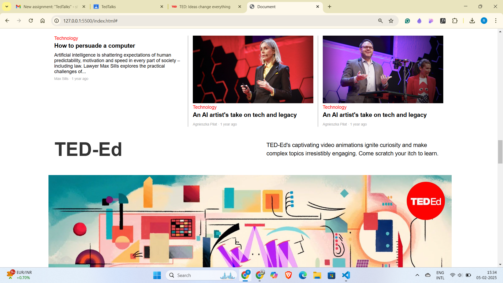

# My Interactive Website Project

Welcome to my **interactive website project** created using **HTML** and **CSS**. This site includes sections for different topics, a responsive layout, and modern design patterns.

## 🚀 Live Demo

You can try out the live version of this website by visiting the following link:

[**Live Demo**](https://yourusername.github.io/your-repository-name)

## 📸 Screenshots

Below are some interactive screenshots from the project:

### Homepage
)

### Science Section
)

### Discover Section
)

###Footer Section
))

## 🌟 Features

- **Responsive Navigation**: The navigation bar adjusts for both mobile and desktop screens.
- **Multiple Sections**: Includes science, culture, climate change, and more.
- **CTA Buttons**: Interactive buttons encouraging engagement with content.
- **Dynamic Discover Section**: Showcases a dynamic, content-rich section.

## ⚙️ Technologies Used

- **HTML**: Used for building the structure of the webpage.
- **CSS**: Used for styling the page, including a mobile-first design approach.
- **FontAwesome**: For icons like the search icon in the navigation bar.
- **Responsive Design**: Ensures a seamless experience across various screen sizes.

